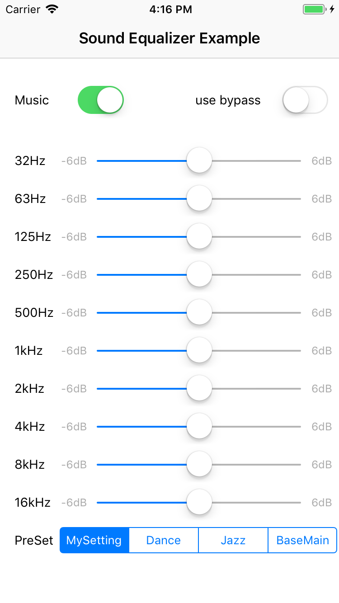

# AVAudio+Equalizer Example for iOS / Swift

[](LICENSE)
[](http://cocoadocs.org/docsets/Auk)

This repository is an iOS sample project that contrains how to use equalizer options created by HanSJin.

## Screenshots




## Code Examples


You can simply create an AudioEngine+Equalizer.

```Swift
let audioManager = AudioManager(music: "bensound-energy")
audioManager.delegate = self
audioManager.setEquailizerOptions(gains: preSets[0])
audioManager.engineStart()
audioManager.play()
```

Here are sample preset options. Also you can test the detail value of equalizer by moving the UISlider in this project.

```Swift
let frequencies: [Int] = [32, 63, 125, 250, 500, 1000, 2000, 4000, 8000, 16000]
var preSets: [[Float]] = [
    [0, 0, 0, 0, 0, 0, 0, 0, 0, 0], // My setting
    [4, 6, 5, 0, 1, 3, 5, 4.5, 3.5, 0], // Dance
    [4, 3, 2, 2.5, -1.5, -1.5, 0, 1, 2, 3], // Jazz
    [5, 4, 3.5, 3, 1, 0, 0, 0, 0, 0] // Base Main
]
```

And can call the delegate.

```Swift
func audioManager(didStart manager: AudioManager) {
    print("music play")
}

func audioManager(didStop manager: AudioManager) {
    print("music stop")
}

func audioManager(didPause manager: AudioManager) {
    print("music pause")
}
```

Getter/Setter for the equalizer options are provided too.

```Swift
var preSet = audioManager.getEquailizerOptions()
preSet[0] = 0.5 // +0.5 dB
audioManager.setEquailizerOptions(gains: preSet)
```

## Music

This project contains bensound-energy.mp3 as sound sample. You can check the source of this music [here](https://www.bensound.com/royalty-free-music/track/energy).

## License

AVAudio+Equalizer is released under the [MIT License](LICENSE).

